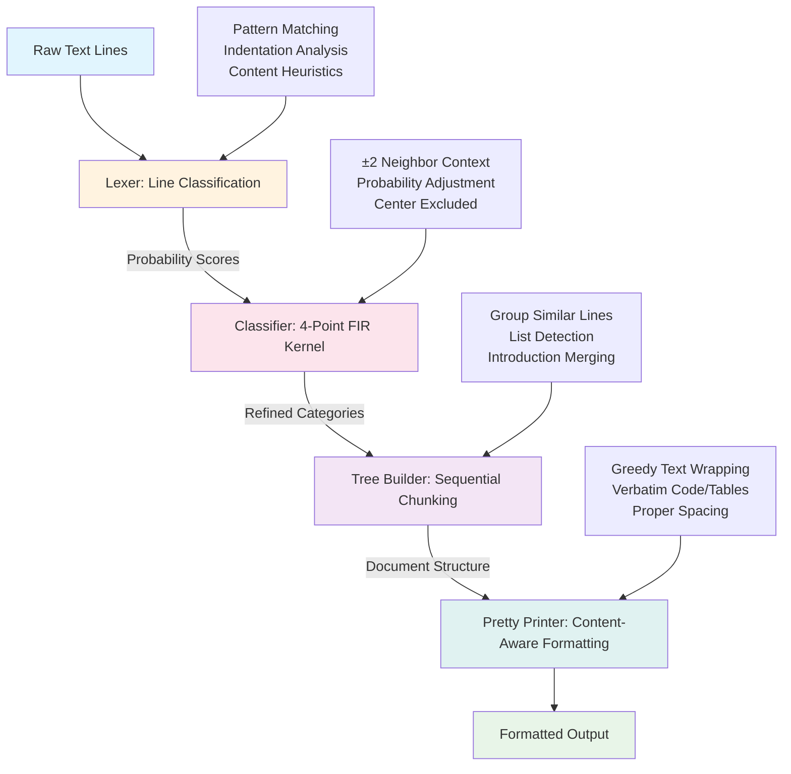

# `rule72` is a git commit message formatter / reflower

Smart command-line formatter that rewraps Git commit messages while
**preserving structure** (headline, paragraphs, nested lists, tables, code
blocks, footers, emoji bullets, etc.). It reads from **stdin** and writes the
reformatted message to **stdout** so it plugs into editors, Git hooks, pipes,
or batch jobs.

Performance: ~1.5ms per commit message on a laptop ⚡.  
Run `just profile` for detailed benchmarks across the test corpus.

---
## What

* Enforces 50-char headline and 72-char body width (configurable).
* Understands Markdown-style bullets (`*`, `-`, numbered, emoji).
* Keeps indentation, continuation alignment, fenced code, URLs, tables.
* Chunk-aware – headline, body blocks, footers detected automatically.
* Written in safe, fast Rust.

---
## Quick Usage

```bash
# Rewrap the current COMMIT_EDITMSG from a Git hook
cat "$1" | rule72 > "$1.tmp" && mv "$1.tmp" "$1"

# Reflow the HEAD commit message (non-interactive amend)
git show --format='%B' --no-patch HEAD | rule72 | git commit --amend --file=-

# Reflow HEAD commit message and edit interactively
git show --format='%B' --no-patch HEAD | rule72 > /tmp/msg && git commit --amend --edit --file=/tmp/msg

# Ad-hoc from shell
printf '%s\n' "fix: extremely long headline ..." | rule72
```

CLI flags:
```
  -w, --width <N>           set body wrap width (default 72)
      --headline-width <N>  advisory headline width (default 50)
      --no-ansi             strip colour codes before measuring width
      --debug-svg <PATH>    generate SVG visualization of parsing/classification
      --debug-trace         output detailed trace of parsing pipeline
```

In the repo you can apply `rule72` across all test-vectors and inspect:

```bash
# Batch-reformat repository message corpus (Justfile target)
just reflow-data   # Updates data.out/ - output reflowed references
just compare-data  # Diff original vs reflowed with colordiff/less
```

---
## Debug Visualization

For explainability and development, `rule72` provides comprehensive debug output:

* **SVG Visualization**: `--debug-svg output.svg` generates a visual breakdown
  showing how each line is classified (prose, list, code, table, etc.) with
  color coding and probability scores.
* **Debug Tracing**: `--debug-trace` outputs detailed parsing pipeline
  information with automatic file:line prefixes, showing input processing and
  classification decisions.

These features help understand how the tool parses complex commit messages and
can aid in troubleshooting formatting decisions.

---
## Test-Catalogue: `data/` vs `data.out/`

The repo ships with a large set of real-world commit messages under `data/`.  
Running `just reflow-data` pipes every `*.txt` file through `rule72`, writing
the result to **identical relative paths** under `data.out/`.  
`just compare-data` opens a unified color diff so you can inspect:

* Correct wrapping of long paragraphs
* List continuation alignment and nested bullets
* Emoji bullets retained as list markers
* Code/table blocks untouched

This serves as an integration regression suite on top of unit tests.

---
## Algorithm (line classification and chunking)

Simple and effective line-by-line processing with contextual refinement.



1. **Line Classification**: Process each line individually, computing indentation
   and assigning probability scores to categories (Prose, List, Code, Table, 
   Comment, Footer, URL, etc.) based on content patterns.
2. **Context Refinement**: Apply a 4-point FIR-like kernel examining ±2 
   neighboring lines (excluding center) to adjust classification probabilities
   based on local context - similar to signal processing techniques.
3. **Sequential Chunking**: Group consecutive lines of similar types into
   document chunks (paragraphs, lists, code blocks, tables, comments).
4. **Pretty-print**: Format each chunk type appropriately - greedy wrap for
   prose & list items, verbatim for code/tables, enforced spacing.
5. **Document Assembly**: Combine headline + body chunks + footers with
   proper semantic structure.

The sequential approach handles nested lists and preserves indentation while
remaining simple and fast.

### Architecture

```
src/
 ├─ main.rs         → CLI argument parsing + stdin/stdout handling
 ├─ lib.rs          → public API and module orchestration
 ├─ lexer.rs        → line-by-line classification with probabilities
 ├─ classifier.rs   → contextual refinement using neighboring lines
 ├─ tree_builder.rs → sequential chunking into document structure
 ├─ pretty_printer.rs → content-aware formatting and wrapping
 ├─ debug.rs        → SVG visualization for explainability
 ├─ types.rs        → core data structures (CatLine, Document, etc.)
 └─ utils.rs        → helper functions and debug tracing
```

Key crates: `clap`, `regex`, `unicode-segmentation`, `unicode-width`,
`anyhow`.

Build tooling via **Nix** + **Just** (`shell.nix`, `Justfile`).

---
## Related Tools

* [`commitmsgfmt`](https://mkjeldsen.gitlab.io/blog/introducing-commitmsgfmt/) –
  Vim filter that inspired many rules; `rule72` generalises with line-by-line
  classification & Rust CLI.
* `fmt(1)`, `par(1)` – generic text wrappers (no commit-specific
  semantics).
